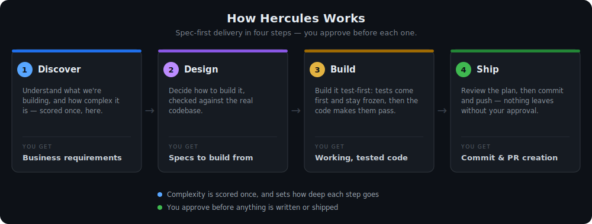

# Hercules

Half god, half man — strong enough to wrestle a lion, patient enough to sit through your kickoff meeting.

With the strength of ten men — or more — Hercules helps you slay your Hydras, your Nemean Lions,
or, more realistically, the vague and ambiguous requirements that derail real work.

Its heroic, **spec-first** workflow — **Discover → Design → Build → Ship** — gets what you're building shipped fast and reliably, without the rework.



*For more details, look into the [detailed diagram](https://htmlpreview.github.io/?https://github.com/mbienkowski/hercules/blob/main/docs/workflow/workflow-diagram-detailed.html).*

**Who it's for:**

- **Solo developers** — move fast without accumulating requirements debt.
- **Engineers** — who want their AI to follow a disciplined process.
- **Non-developers (QA, product)** — turn messy notes into clear, reviewable requirements.
- **Teams** — every feature traceable from requirement to merged code.

> **New to the terms?**
> - **Plugin:** an add-on you install into Claude Code.
> - **Marketplace:** a source (here, a GitHub repo) you add plugins from.
> - **Agent:** a specialist persona Claude can consult.
> - **Business requirements:** the permanent, plain-language "what & why" doc.
> - **Spec:** specification — a temporary technical blueprint, deleted once delivered in code.
> - **Mutation testing:** a quality check that deliberately introduces bugs to confirm your tests actually catch them — not just run green.

---

## Install

**Prerequisite:** Hercules runs *inside* [Claude Code](https://code.claude.com) — install Claude Code first.

You don't need any extra executables to run this plugin.

Then, three steps:

**1 — Add the marketplace and install the plugin.** In Claude Code (CLI or Desktop), type:

```
/plugin marketplace add mbienkowski/hercules
/plugin install hercules@mbienkowski
```

`hercules@mbienkowski` is `plugin@marketplace` (the plugin named `hercules`, from `mbienkowski`'s
marketplace). The `/plugin` and `/hercules:*` commands are typed **inside Claude Code**, not in a terminal.

**2 — Verify.** Run `/help` (or `/plugin`) and confirm the `/hercules:` commands appear. If they don't,
the plugin is installed-but-disabled — enable it from the `/plugin` screen.

**3 — Start.** Run:

```
/hercules:workflow
```

If this is a new repo, Hercules will detect it and walk you through the one-time setup first.

When enabled, Hercules becomes your **default agent** — that's why you can also just say
*"Hercules, where do I start?"*. This means Hercules is active for every Claude Code session where
this plugin is enabled — it does not add instructions to Claude sessions where the plugin is off.
The `/hercules:*` commands run the phases.

### Claude Code Desktop
Same flow: type the `/plugin` commands in the chat, **or** use the in-app plugin browser (the `+` near
the prompt → **Plugins** → add marketplace / install). It is *not* a "Settings → Plugins" page.

### For a team (or CI) — no typing
Declare it once in `settings.json` (user `~/.claude/settings.json`, project `.claude/settings.json`, or
local) so everyone gets Hercules on clone:

```json
{
  "extraKnownMarketplaces": {
    "mbienkowski": { "source": { "source": "github", "repo": "mbienkowski/hercules" } }
  },
  "enabledPlugins": { "hercules@mbienkowski": true }
}
```

**If you want to pin installation to a specific version**, add a `ref` to a release tag (a commit
SHA also works) for reproducible installs across every machine and in CI — omit it (as above) and
the install tracks the default branch, which drifts. When scopes conflict, the more-specific one
wins (local over project over user). Updates are manual (`/plugin marketplace update mbienkowski`),
so a pinned `ref` only moves when you bump it.

Use the **project** scope to standardize a whole repo; consider an org fork + a pinned version for
governance. This file merges with any existing Claude Code settings — it does not replace them.

| Your situation | Use |
|---|---|
| Just want the plugin (most people) | **Marketplace** — the steps above |
| A whole team / CI | **`settings.json`** (`extraKnownMarketplaces` + `enabledPlugins`) |

### For maintainers — testing a branch before release

To test a branch without installing from the public marketplace, add a temporary marketplace entry
pointing at your branch. Put this in `~/.claude-priv/settings.json` (or `~/.claude/settings.local.json`)
so it stays off-project and out of git:

```json
{
  "extraKnownMarketplaces": {
    "hercules-dev": {
      "source": {
        "source": "github",
        "repo": "mbienkowski/hercules",
        "ref": "your-feature-branch"
      }
    }
  },
  "enabledPlugins": { "hercules@hercules-dev": true }
}
```

`ref` accepts a branch name, tag, or commit SHA. Omit it to use the repo's default branch.

Then restart Claude Code (the settings are read at startup). The plugin resolves from that branch.
When you're done, remove the entry and restart again to go back to the released version.

---

## Quickstart

The fastest way to start is the guided workflow — Hercules walks you through every phase:

```
/hercules:workflow
```

Or run each phase on its own. Outputs are dated Markdown files (`YYYY-MM-DD` = today's date; `desc` = a
short slug; `NN` = the spec number):

| Command | Phase | Focus | What it produces |
|---|---|---|---|
| `/hercules:discover` | Discover — **WHAT** | Pin the real need | a `*-business-requirements.md` (the permanent "what & why") |
| `/hercules:design` | Design — **HOW** | Turn it into a spec | one or more `*-spec-NN-*.md` build blueprints |
| `/hercules:build` | Build — **MAKE** | Approve the delivery plan, then build & verify | working code + tests (specs deleted once delivered in code) |
| `/hercules:ship` | Ship — **COMMIT** | Commit the delivered work | a conventional commit + optional push + optional PR |

Each feature is its own workflow run — start a new one any time with `/hercules:workflow` and a feature
description. Your `docs/` folder accumulates business-requirements files over time; specs are temporary
and deleted once the feature is delivered in code (during Build, when code becomes the source of truth). Multiple features
can be in-flight simultaneously — each gets its own spec files with unique sequential numbers.

---

## Before your first feature

> **Optional — but the difference between an agent that guesses at your standards and one that
> follows them.** On a new repo, `/hercules:workflow` offers this automatically — you don't have to
> remember it. To run it on its own, just ask Hercules to set up your code of conduct.

Run `code-of-conduct-generator` once per repo — the one-time onboarding step that calibrates every
Hercules agent to your actual standards before touching code. Run it **even if you already have a Code
of Conduct**: it reads your repository (and any existing CoC) and upgrades it — additions only — into
a standards file tuned for *how* the agents implement (architecture, testing, and quality behaviours),
not just contributor etiquette.

**What it does in three steps:**

1. Scans the repo — architecture patterns, test layout, lint config, CI gates, delivery norms
2. Asks 5–10 questions in a single batch: the things the scan can't infer — design decisions,
   coverage targets, why a particular pattern was chosen
3. Presents the full draft as a plan for you to approve or edit before anything is written

> **A focused setup now compounds into smoother delivery on every future feature.** No corrections
> mid-build, no agents guessing at your testing bar. The structure is permanent; the payoff repeats.

The result is a `CODE_OF_CONDUCT.md` with up to six sections — Architecture (including design
patterns and why they're used), Development, Testing, Quality Gates, API, and Delivery. Bullet
points only, no prose to skim past.

Once it exists, you don't run it again unless your standards change.

## Your first session

Type `/hercules:workflow`. Discovery is where the real work happens — bring everything you have:
PRDs, ADRs, Figma links, QA scenarios, API contracts, Slack threads. The more context you bring, the
better. Hercules will always paraphrase what it understood before writing — correct it if anything's
off. Your first session ends with a requirements document saved to `docs/`.

Every phase works the same way: Hercules presents a plan and waits for your approval before doing
anything. Discover and Design draft a document and write it to `docs/` on approval — you can revisit
it any time. Build presents a delivery plan — which specs, in what order, grouped how — and on
approval delivers them test-first (you choose to ship each spec as it lands, or deliver all in one
pass). Ship drafts the commit plan and, on approval, commits and pushes. One approval per phase;
nothing happens before it. That's the whole loop. Repeat for every feature.

### What that looks like

```
You:       /hercules:workflow — we need password reset for the web app.
Hercules:  A few gaps before I write this up:
           • who can trigger a reset — any user, or only verified emails?
           • token lifetime?
           • is email delivery in scope, or assumed?
You:       Any user with a registered email; 30-minute token; email delivery is out of scope.
Hercules:  Here's the draft (business language, no code). Review it, then say `approved`:
```
```markdown
# Business Requirements: password-reset
## Goal
Let a user who forgot their password regain access without contacting support.
## Users
Registered users with a verified email address.
## Scope
In: request a reset, receive a one-time link, set a new password.
Out: the email-delivery service itself (already exists).
## Success criteria
A reset link works once, expires after 30 minutes, and never reveals whether an email is registered.
```

---

## Where your delivery docs live

Hercules keeps every requirement and spec in **one place** your team can version and review like code.
By default that's `docs/` in the directory where you launch Claude. To change it, name the directory (or
a dedicated docs repo) once in your project's **`code-of-conduct.md`** — a *per-project, lowercase*
config file Hercules reads at runtime. (Not to be confused with this repo's `CODE_OF_CONDUCT.md`, which
is the contributor guide.)

A feature that spans several services? Tell Hercules the local path to each — it asks once and remembers
them on **your machine only**, under `~/.hercules/` (a registry `config.json` plus a per-project state
file; auto-written; it stores only local filesystem paths and delivery progress — no credentials,
tokens, or telemetry). Nothing about where your repos live is written into the docs themselves.

---

## How it works

Every feature runs the **same four phases** — the process is constant; what scales is the **number of
advisors**. Hercules brings strength in proportion to the task: a typo runs no advisor debate; a
payment migration convenes the full council. Right-sized effort, never overkill on a small change nor
under-prepared on a large one.

1. **Discover — WHAT** (the heaviest phase) — pins the real need, who benefits, what's in/out of
   scope, and what "done" means. Output: a permanent `*-business-requirements.md`, in plain business
   language. On a large feature, Discover may span multiple sessions; the draft is saved and picked up
   where you left off.
2. **Design — HOW** — turns requirements into one or more self-contained **specs**, challenged by
   specialist advisors before any code. Output: `*-spec-NN-*.md` (temporary).
3. **Build — MAKE** — opens with a delivery plan you approve (which specs, in what order, grouped
   how), then delivers each spec test-first: scaffold, write the failing tests (frozen once written),
   implement, and pass the quality gates your `code-of-conduct.md` defines. A cross-check then confirms
   the delivery matches the requirements. Output: code + tests. The specs are deleted once delivered in code (`git rm`).
4. **Ship — COMMIT** — after Build completes and you've reviewed the diff, drafts a commit
   plan (files to stage, commit message, push target), waits for your approval, then executes
   automatically. No follow-up questions.

**Two documents, two lifecycles.** Business-requirements are **long-lived** — committed forever, in
business language, the shareable record of what a feature is *for*. Specs are **per-development** — once
delivered in code, they're deleted, because the code, its tests, and git history become the source of truth.

**Complexity scoring (so depth isn't guesswork).** In Discover, Hercules scores the feature on
*effort* and *blast-radius* (how many users or systems a bug could harm) and takes the higher of the two.

| Tier | Effort signals | Blast-radius signals | Advisors |
|---|---|---|---|
| trivial | typo, config tweak | no user-visible change | 0 |
| low | single-service change | one bounded flow affected | 1–2 |
| medium | cross-service or new API | multiple flows affected | 1–3 |
| high | auth, payments, migration | data at risk, deletion, prod config | 2–4 |
| critical | multi-service migration | user data, security primitives, money | 3–6 |

Only **trivial** skips the advisory board; every other tier runs it, scaled to the number above. A
change touching **auth, secrets, money, data migration, deletion, production config, or concurrency**
is floored at `high` regardless of how small the diff looks. You see the score and can override it; a
single substantiated dissent escalates the tier.

**Quality has numbers, not adjectives.** Build gates on the **branch-coverage** and **mutation-kill**
thresholds your project's `code-of-conduct.md` sets — the generator suggests **≥90%** for both as a
default, and you can change them. Mutation testing checks that your tests actually catch bugs, and a
requirement ships only when a **named test** asserts it. These are mandatory steps, not best-practices
you skip under pressure.

---

## Philosophy

**Ambiguous requirements are not fast. They're time borrowed against rework.**

Ask why a feature took far longer than estimated — the answer is almost always something
that wasn't nailed down at the start. Hercules is front-heavy on purpose: the time invested in
Discover and Design pays back in less rework, fewer misbuilt features, and code that does what
was actually needed. The work that feels slow upfront is the work that doesn't come back as fixes
later.

- **Works for one or for ten.** Clear requirements are not a team-size question — they're a "do
  you want to do this twice?" question. A solo developer under deadline pressure benefits from
  Discover as much as a team of ten.
- **Structured speed, not slow and careful.** Move fast, use AI to amplify your pace, but move
  with intent. Discover defines what you're actually building. Design decides how. Build and Ship
  execute against a spec the human approved — not against a guess. The structure is what makes
  the speed reliable.
- **All four phases, every time — depth scales, not the phases.** Every feature runs Discover →
  Design → Build → Ship and produces the same artifacts; what changes with complexity is the
  number of advisors (a trivial task runs none). Not because ceremony is the goal, but because
  even a one-line change in production code has a business reason. That reason belongs in
  `business-requirements.md` so six months from now anyone reading the history knows *why*
  something changed — not just what. The trivial path is fast — fewer advisors, same traceability.
- **Human in the loop, by design.** The human decides what is needed. Hercules ensures that
  decision is captured, challenged, and executed faithfully — with tests, traceability, and a
  clean git record. If you want an AI that acts without asking, this is the wrong tool. If you
  want an AI that amplifies your judgment and delivers exactly what you intended, this is it.
- **When not to use it.** Validating a throwaway idea? Building a proof-of-concept you'll
  discard? Skip the ceremony — it's overhead you don't need yet. Come back when you're building
  for production: code that will be maintained, extended, or handed to someone else. That's when
  clear requirements stop being optional.

Bring discipline and it amplifies it. Rush the process and Hercules will faithfully build what
you described — which may not be what you needed. **You own the quality of what you build;**
Hercules makes it easier to do that well.

---

## Updating

Updates are **manual** — Claude Code does not auto-update plugins. Pull the latest when you want to:

```
/plugin marketplace update mbienkowski
```

(`mbienkowski` is the marketplace source name — the same source you registered in step 1.
This refreshes all plugins from it.) You can pin or roll back through Claude Code's plugin manager.

---

## Uninstalling

To remove the plugin and its marketplace entry:

```
/plugin uninstall hercules@mbienkowski
/plugin marketplace remove mbienkowski
```

---

## Requirements

- **Claude Code** — the plugin runs entirely inside it.
- **Python ≥ 3.9** — only for contributing (running the tests). The plugin itself needs no Python.

---

## Contributing

Read [`CODE_OF_CONDUCT.md`](CODE_OF_CONDUCT.md) first — it defines the rules for extending commands,
agents, and skills, plus how to run the tests.

1. Fork and create a branch (use hyphens, no slashes)
2. Add or edit files in `plugin/commands/`, `plugin/agents/`, or `plugin/skills/`
3. Test the plugin locally: add **your local checkout** as a marketplace —
   `/plugin marketplace add /path/to/your/checkout`. Its `marketplace.json` declares the name
   `mbienkowski`, so `/plugin install hercules@mbienkowski` then resolves to **your checkout**. If
   you've already added the public marketplace under that same name, remove it first
   (`/plugin marketplace remove mbienkowski`) so the name isn't ambiguous — otherwise you'd test the
   released version, not your changes. `git checkout` the branch you want to test.
4. Run the suite: `pip install -e ".[dev]" && make test`
5. Open a PR — CI runs the full suite plus mutation testing and validates the plugin package. Commit
   messages follow Conventional Commits (`feat:`/`fix:`/`feat!:`), which drive the version on release.

For a local dev clone:

```bash
git clone https://github.com/mbienkowski/hercules.git
cd hercules
pip install -e ".[dev]"   # installs test dependencies (pytest, mutmut) — needed to run make test
```

All `.md` filenames must be **lowercase** — macOS is case-insensitive but Linux is not.

---

## Plugin permissions

Hercules is a set of Markdown files — commands, agents, and skills — interpreted by Claude Code.
It has no executable code of its own. What it can do is exactly what Claude Code can do in your session:

- **Project files** — reads your project files to understand context; writes to `docs/` (or wherever
  `code-of-conduct.md` points). Nothing is written outside directories Claude Code already has access to.
- **`~/.hercules/`** — full read/write/create access to this directory. It holds a registry
  (`config.json`) and per-project delivery-state files (`state/*.json`): local filesystem paths and
  delivery progress only (no credentials, no tokens, no telemetry, no code snippets).
- **Shell** — only during Build, when tests need to run. Claude Code executes the command; Hercules
  issues no shell commands independently.
- **Network** — none. All model calls go through your existing Claude Code session and API key.
  Hercules makes no direct API calls and opens no separate network channel.

You can audit the full plugin source in the `plugin/` directory of this repository.

---

## Why sub-agents?

A single model in a single pass has predictable failure modes. Specialist advisors counter each — and
Hercules always **asks before running them** (they cost tokens and time, so it scales them to
complexity and adds none for trivial work).

- **Agents echo each other, and models are sycophantic.** Research shows AI is 49% more likely than
  humans to affirm users even when it knows the right answer, and agrees with wrong answers 51% of the
  time ([Science 2026](https://www.science.org/doi/10.1126/science.adp9289)). The *structural* counter
  is a **blind round**: each advisor forms its position independently, before seeing the others — then a
  consensus round, so agreement has to be earned, not echoed. Advisors are briefed with deliberately
  opposing agendas (e.g. a Cynical Reviewer vs. a Simplicity Advocate), because good decisions come
  from tension.
- **Multi-agent systems can still echo each other.** In 2,500+ simulations, agents conformed to the
  majority in up to 83% of cases — driven by numbers, not reasoning. Opposing agendas are the
  structural fix, not just a nice-to-have.
- **One agent can only follow so many instructions.** At 150 instructions the best model followed ~96%;
  at 500, ~68.9% — the drop is non-linear and invisible (no error, no warning)
  ([arxiv.org/html/2507.11538v1](https://arxiv.org/html/2507.11538v1)). Splitting work across focused
  advisors keeps each one in its high-adherence range.
- **Context drifts over long sessions.** The counter: a spec locked before code, and TDD that freezes
  expected behaviour into tests. Fresh advisors re-read the spec, not the chat history.
- **Output volume feeds the drift.** The counter: a terse agent-communication protocol — structured,
  low-noise replies.
- **The debate costs fewer tokens than reworking a missed spec.** A requirement gap that slips into
  Build means restated requirements, revised specs, re-run tests, and a second review cycle — far
  more costly than the advisor debate that would have caught it upfront. The A2A communication
  protocol keeps advisor messages structured and low-noise, bounding the per-debate cost. The debate
  is the cheap path; rework is the expensive one.

You stay in control: advisors are a recommendation you approve, never automatic.
