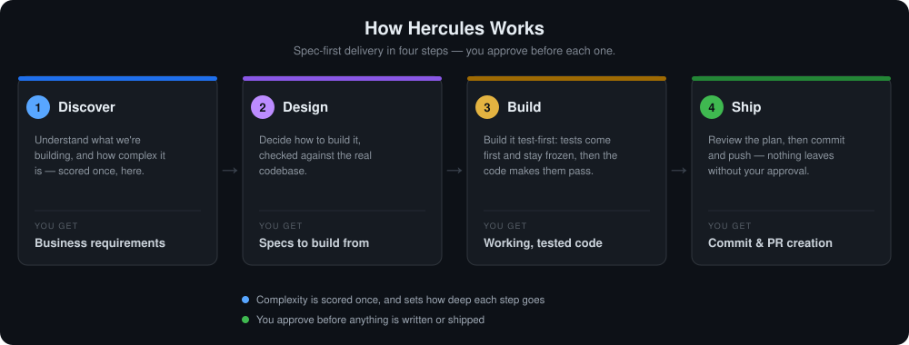

# Hercules

[](https://github.com/mbienkowski/hercules/actions/workflows/ci.yml)
[](https://github.com/mbienkowski/hercules/releases)
[](https://github.com/mbienkowski/hercules/blob/main/LICENSE)

[](#install-claude-code)
[](#install-codex)
[](#install-cursor)
[](#install-gemini-cli)
[](#install-github-copilot-cli)
[](#install-grok-build)
[](#install-opencode)

Half god, half man — strong enough to wrestle a lion, patient enough to sit through your kickoff meeting.

**Hercules is a universal, spec-first delivery plugin** — installed natively in your AI coding tool — that enforces **Discover → Design → Build → Ship** so what you're building ships fast and reliably, without the rework.



*For more details, look into the [detailed diagram](https://htmlpreview.github.io/?https://github.com/mbienkowski/hercules/blob/main/docs/workflow/workflow-diagram-detailed.html)
(or open `docs/workflow/workflow-diagram-detailed.html` from a clone if the preview proxy is slow).*

**Who it's for:**

- **Non-developers - Product & QA** — turn messy notes into clear, reviewable requirements;
  acceptance criteria are written in plain business language you can sign off; nothing is
  built until you approve the plan.
- **Solo developers** — move fast without accumulating requirements debt; a built-in advisory
  board challenges your design before any code; an independent reviewer — plus coverage and
  quality gates — holds the quality bar when you're the only human on it.
- **Teams** — every feature traceable from requirement to merged code; built-in handoff notes
  and checkpoints let anyone pick up mid-build; one shared standard from your
  `code-of-conduct.md`, enforced identically for everyone.

> **New to the terms?**
> - **Plugin:** an add-on you install into your AI coding tool.
> - **Marketplace:** a source (here, a GitHub repo) you add plugins from.
> - **Agent:** a specialist persona Claude can consult.
> - **Business requirements:** the permanent, plain-language "what & why" doc.
> - **Spec:** specification — a technical blueprint for one build; removed on delivery by default, kept if you say so (see § How it works).
> - **`code-of-conduct.md`:** your *per-project, lowercase* standards file that Hercules reads at runtime — not this repo's contributor `CODE_OF_CONDUCT.md`.
> - **Mutation testing:** a quality check that deliberately introduces bugs to confirm your tests actually catch them — not just run green.

---

## How it works

Every feature runs the **same four phases**. Each phase opens with a plan and waits for your
approval before writing or executing anything — one Plan-approval gate per phase (clarifying
questions can come before it).

| Phase | Answers | What happens | Output |
|---|---|---|---|
| **Discover** | **WHAT** | Pins the real need — who benefits, scope, and what "done" means. The heaviest phase; bring everything you have. | `*-business-requirements.md` — permanent, plain business language |
| **Design** | **HOW** | Turns requirements into self-contained specs, challenged by specialist advisors before any code. | one or more `*-spec-NN-*.md` build blueprints |
| **Build** | **MAKE** | You approve a delivery plan (which specs, in what order, grouped how), then each spec ships test-first: real tests (frozen once written; unblock any by asking), implementation, and the quality gates your `code-of-conduct.md` defines. | working code + tests |
| **Ship** | **COMMIT** | After you review the diff, Hercules drafts a commit plan, waits for approval, then executes. No follow-up questions. | a conventional commit + optional push + optional PR |

Outputs are dated Markdown files (`YYYY-MM-DD` = today's date; `desc` = a short slug; `NN` = the
spec number), saved to `docs/` by default (see § Where your delivery docs live).

**Two documents, two lifecycles:**

- **Business-requirements** — long-lived, committed forever, in business language: the shareable
  record of what a feature is *for*.
- **Specs** — **removed on delivery by default** (`git rm` once the spec is delivered in code —
  code, tests, and git history become the source of truth). This is a setting, not a law: put
  *"always keep the specs"* in your `code-of-conduct.md` and delivered specs are kept and
  refreshed instead of deleted.

What scales with complexity is the **review**, not the phases: how many advisors are convened, and
how far they argue. A typo runs none; a payment migration convenes the full council and lets it
disagree. Effort is sized to the change.

**Complexity scoring (so depth isn't guesswork).** Discover scores the feature on *effort* and
*blast-radius* (how many users or systems a bug could harm) and takes the higher:

| Tier | Effort signals | Blast-radius signals | Advisors | Rounds |
|---|---|---|---|---|
| trivial | typo, config tweak | no user-visible change | 0 | 0 |
| low | single-service change | one bounded flow affected | 2 | 1 |
| medium | cross-service or new API | multiple flows affected | 2–3 | 1–2 |
| high | auth, payments, migration | data at risk, deletion, prod config | 3–5 | 1–2 |
| critical | multi-service migration | user data, security primitives, money | 4–6 | 2–3 + fresh eyes |

- **Only `trivial` skips the board** — every other tier proposes one, sized by the table above, and you decide it
  advisor by advisor: accept the proposal, drop any of them, or name someone else. Nothing spawns before you answer.
- **The rounds column is a ceiling, not a schedule** — a second round runs only where the first left advisors disagreeing. A debate that converges ends there. `critical` is the exception: it always runs its second round and a fresh-eyes panel, because that is where a missed problem is least recoverable.
- **High-risk surfaces are floored at `high`** — auth, secrets, money, data migration, deletion, production config, concurrency, or personal data, however small the diff. Those are examples, not a closed list: your `code-of-conduct.md` can add to them, and Hercules floors anything else it judges equally consequential — and says so when it does.
- **You stay in control** — you see the score and can override it; advisor dissent is input you weigh, never an automatic re-score.

**Quality has numbers, not adjectives:**

- **Coverage** — Build gates on the branch-coverage threshold your `code-of-conduct.md` sets.
- **Mutation** — a kill-rate gate runs when the CoC defines one (the generator defaults to **≥90%**); it checks your tests actually catch bugs.
- **Traceability** — a requirement ships only when a **named test** asserts it, decided by an **independent reviewer**, not the session that wrote the code.
- **Not optional** — once a gate applies, it is not a best-practice you skip under pressure.

---

## Install

Hercules installs natively in each supported ecosystem — **pick yours**. At a glance:

| Ecosystem | Install via | Commands look like | Frozen-test enforcement |
|---|---|---|---|
| [Claude Code](#install-claude-code) | marketplace (`/plugin`) | `/hercules:workflow` | ✅ real pre-write veto (`PreToolUse`) |
| [Codex](#install-codex) | marketplace (`codex plugin`) | `$hercules-workflow` | ⚠️ guardrail over `apply_patch` + `Bash` — not a sandbox |
| [Cursor](#install-cursor) | copy `dist/cursor/` | `/workflow` | ⚠️ best-effort: shell/MCP deny + advisory on IDE edits |
| [Gemini CLI](#install-gemini-cli) | `gemini extensions install` | `/workflow` | ✅ real pre-write veto (`BeforeTool`) |
| [GitHub Copilot CLI](#install-github-copilot-cli) | marketplace (`copilot plugin`) | `/workflow` | ✅ real pre-write veto (`preToolUse`) |
| [Grok Build](#install-grok-build) | marketplace (`/marketplace`) | `/hercules:workflow` | ✅ real pre-write veto (`PreToolUse`) |
| [OpenCode](#install-opencode) | `opencode.json` entry | `/hercules:workflow` | ✅ real pre-write veto (`tool.execute.before`) |

Every enforcement hook runs through your system `python3` and **fails open** without it
(§ Requirements). Each ecosystem's exact capabilities and disclosed gaps live in
`dist/<ecosystem>/CAPABILITIES.md`.

<details id="install-claude-code">
<summary><b>Claude Code</b></summary>

- **Requires** [Claude Code](https://code.claude.com); no extra packages (hooks use your system `python3` — § Requirements).
- **Install** — in Claude Code, CLI or Desktop (`hercules@mbienkowski` = `plugin@marketplace`):

```
/plugin marketplace add mbienkowski/hercules
/plugin install hercules@mbienkowski
/reload-plugins
```

- **Verify** — `/help` (or `/plugin`) lists the `/hercules:` commands; if not, enable it from the `/plugin` screen.
- **Start** — `/hercules:workflow`.
- **Desktop** — same commands in the chat, or the in-app plugin browser (`+` near the prompt → **Plugins**; *not* a "Settings → Plugins" page).
- **Team / CI — no typing.** Declare it once in `settings.json` (user `~/.claude/settings.json`, project `.claude/settings.json`, or local); everyone gets Hercules on clone. Merges with existing settings, never replaces them:

```json
{
  "extraKnownMarketplaces": {
    "mbienkowski": { "source": { "source": "github", "repo": "mbienkowski/hercules" } }
  },
  "enabledPlugins": { "hercules@mbienkowski": true }
}
```

- **Pin a version** — add a `ref` (release tag or commit SHA) to the source for reproducible installs; omit it (as above) to track the default branch. A pinned `ref` moves only when you bump it; updates otherwise via § Updating.
- **Scope** — most-specific wins (local > project > user). **Project** scope standardizes a repo; for governance, an org fork + a pinned version.

</details>

<details id="install-codex">
<summary><b>Codex</b></summary>

- **Requires** the Codex app or Codex CLI with plugin support, plus `python3` for the frozen-test hook.
- **Install** — straight from GitHub, no clone or build needed:

```bash
codex plugin marketplace add mbienkowski/hercules
codex plugin add hercules@mbienkowski
```

- **App** — restart, open **Plugins** → `mbienkowski` marketplace → enable Hercules; trust its hooks when prompted.
- **Build locally** (optional) — `npm install && make build` emits `dist/codex/`, exposed via `.agents/plugins/marketplace.json` for local testing.
- **Start** — `$hercules-workflow` (per-phase: `$hercules-discover`, `$hercules-design`, `$hercules-build`, `$hercules-ship`).
- **Project guidance** — Codex reads the generated `AGENTS.md` once copied into your project; skills and hooks come from the plugin itself.
- **Enforcement** — a hook over `apply_patch` + `Bash` events: a guardrail, not a sandbox; Build's pre-advance `git diff` backstop catches shell-side edits. Gaps in `dist/codex/CAPABILITIES.md`.

</details>

<details id="install-cursor">
<summary><b>Cursor</b></summary>

- **Requires** [Cursor](https://cursor.com) **≥ 2.5** (plugin packaging; isolated advisor subagents landed in 2.4).
- **Install** — copy the built `dist/cursor/` into `~/.cursor/plugins/local/hercules/`, then restart Cursor.
- **Verify** — **Customize → Plugins**: the persona rule always applies, the `/discover … /workflow` commands appear, advisors run as isolated subagents.
- **Start** — `/workflow`.
- **Enforcement — best-effort tier** (Cursor can't block an edit before it lands, so the frozen-test lock is weaker than the pre-write veto elsewhere):
  - **Shell/MCP writes** — denied by hook (coarse: `git add .`-style pathspec staging slips past).
  - **IDE edits** — advisory notice, your tree untouched; you undo it or grant an override.
  - **Headless `cursor-agent` runs** — auto-restore via `git checkout` (no human present to act on a notice).
  - **Acceptance gate** — frozen tests re-hashed before a spec retires; a strong catch, not an unbypassable lock.
  - **Independent review** — the reviewer must return a handshake or Hercules HALTs; fully forced only via headless `cursor-agent -p`.
  - Gaps in `dist/cursor/CAPABILITIES.md`.

</details>

<details id="install-gemini-cli">
<summary><b>Gemini CLI</b></summary>

- **Requires** [Gemini CLI](https://github.com/google-gemini/gemini-cli) — `npm install -g @google/gemini-cli`.
- **Install** — clone this repo, then `gemini extensions install ./dist/gemini-cli`.
- **Start** — restart Gemini, then `/workflow`.
- **Enforcement** — a real `BeforeTool` veto (needs `python3`); gaps in `dist/gemini-cli/CAPABILITIES.md`.

</details>

<details id="install-github-copilot-cli">
<summary><b>GitHub Copilot CLI</b></summary>

- **Requires** [GitHub Copilot CLI](https://github.com/github/copilot-cli) — `npm install -g @github/copilot`.
- **Install** — `copilot plugin marketplace add mbienkowski/hercules`, then `copilot plugin install hercules@hercules`.
- **Start** — `/workflow`.
- **Enforcement** — a real `preToolUse` veto (needs `python3`); gaps in `dist/copilot-cli/CAPABILITIES.md`.

</details>

<details id="install-grok-build">
<summary><b>Grok Build</b></summary>

- **Requires** [Grok Build](https://x.ai/cli) — `npm install -g @xai-official/grok` (reads Claude-format plugins natively).
- **Install** — add `mbienkowski/hercules` as a marketplace source, then install **hercules** from Grok's `/marketplace`.
- **Start** — `/hercules:workflow`.
- **Enforcement** — a real `PreToolUse` veto (needs `python3`); gaps in `dist/grok-build/CAPABILITIES.md`.

</details>

<details id="install-opencode">
<summary><b>OpenCode</b></summary>

- **Requires** [OpenCode](https://opencode.ai).
- **Install** — add the GitHub repo to your `opencode.json` (the canonical install):

```json
{
  "plugin": ["github:mbienkowski/hercules"]
}
```

- **Start** — restart OpenCode, then `/hercules:workflow`.
- **Enforcement** — a real `tool.execute.before` veto (needs `python3`); gaps in `dist/opencode/CAPABILITIES.md`.

<details>
<summary><i>Alternative: npm</i></summary>

Also published to npm as `hercules` — reference the package name instead:

```json
{
  "plugin": ["hercules"]
}
```

</details>

</details>

---

## Quickstart

Once installed:

- **It's your default delivery partner** — just say *"Hercules, where do I start?"*, or run the
  workflow command in your ecosystem's form (the table in § Install); it steers only the sessions
  where the plugin is enabled.
- **New repo?** Hercules detects it and walks you through the one-time setup first
  (§ Before your first feature).

The fastest way to start is the guided workflow — Hercules walks you through all four phases:

```
/hercules:workflow
```

Or run any phase on its own: `/hercules:discover`, `/hercules:design`, `/hercules:build`,
`/hercules:ship` — adjusting the prefix to your ecosystem.

- **One run per feature** — start a new one any time with the workflow command and a description; multiple can be in-flight at once, each with its own sequentially-numbered spec files.
- **Your `docs/` accumulates** business-requirements files, a session digest (`docs/INDEX.md`), and reusable lessons (`docs/learnings.md`); spec files come and go per their lifecycle (§ How it works).
- **Abandon a run mid-flight** by saying **"abandon this session"** — its INDEX row is marked abandoned and its state cleared; your docs stay yours.

---

## Before your first feature

> **Optional — but the difference between an agent that guesses at your standards and one that
> follows them.** On a new repo, `/hercules:workflow` offers this automatically — you don't have to
> remember it. To run it on its own, just ask Hercules to set up your code of conduct.

Run `code-of-conduct-generator` once per repo — the one-time onboarding step that calibrates every
Hercules agent to your actual standards before touching code. Run it **even if you already have a Code
of Conduct**: it reads your repository (and any existing CoC — code of conduct) and upgrades it — additions only — into
a standards file tuned for *how* the agents implement (architecture, testing, and quality behaviours),
not just contributor etiquette.

Keep it lean: every agent reads the whole file on top of its own instructions, and models follow
fewer instructions reliably as the total grows — the generator aims for **30–40 directives**
(up to 50 for a big repo; 70 is the hard ceiling). A focused CoC is followed; an 80-bullet org
standard is skimmed.

**What it does — an evidence-first, bounded pass (Quick or Thorough):**

1. Scans the target repo in a few minutes, config-first — architecture and design patterns, test
   layout, lint/CI gates, and the commit/branching/merge/release conventions its history proves —
   reconciling config against the code so it never enforces a rule the code doesn't follow
2. Asks a focused batch of questions: design intent, coverage targets,
   and which standard wins where the codebase runs two — plus accept/decline on any recommended gate
3. Drafts **only from repo evidence + your answers**, then checks for any missing rules and critically
   reviews the draft to catch anything unfounded or vague (a full advisor panel is opt-in)
4. Gates every rule before you see it — exactly one reading, no conflicts, a mechanical check named
   inline, and a captured observation behind it; "looks nice" is never enough
5. Presents only the genuine decisions, writes an **enforced-only** file on approval (recommendations
   stay in chat), and commits it once you've reviewed it — push is offered, never automatic

> **A focused setup now compounds into smoother delivery on every future feature.** No corrections
> mid-build, no agents guessing at your testing bar. The structure is permanent; the payoff repeats.

The result is a `code-of-conduct.md` with up to six sections — Architecture (including design
patterns and why they're used), Development, Testing, Quality Gates, API, and Delivery. Bullet
points only, no prose to skim past.

Once it exists, you don't run it again unless your standards change.

## Your first session

Type `/hercules:workflow`. Discovery is where the real work happens — bring everything you have:
PRDs (product requirement docs), ADRs (architecture decision records), Figma links, QA scenarios, API
contracts, Slack threads. The more context you bring, the
better. Hercules will always paraphrase what it understood before writing — correct it if anything's
off. Every phase then follows the plan → your approval → execution loop from § How it works — nothing
is written or run before your yes. Your first session ends with a requirements document saved to
`docs/`. That's the whole loop — repeat it for every feature.

### What that looks like

```
You:       /hercules:workflow — we need password reset for the web app.
Hercules:  A few gaps before I write this up:
           • who can trigger a reset — any user, or only verified emails?
           • token lifetime?
           • is email delivery in scope, or assumed?
You:       Any user with a registered email; 30-minute token; email delivery is out of scope.
Hercules:  Classifying this as **high complexity** — it touches the auth surface (floored at high).
           Agree, or override?
You:       Agree.
Hercules:  High complexity recommends advisors — business-analyst, security-expert, challenger.
           Run them?
You:       Yes.
Hercules:  Here's the draft (business language, no code). Review it, then say `approved`:
```
*(Condensed — Discover actually walks goal, users, scope, constraints, and success criteria one
topic at a time, and the advisor debate runs before the draft.)*
```markdown
# Business Requirements: password-reset
## Goal
Let a user who forgot their password regain access without contacting support.
## Users
Registered users with a verified email address.
## Scope
In: request a reset, receive a one-time link, set a new password.
Out: the email-delivery service itself (already exists).
## Constraints
Reset tokens are single-use and expire after 30 minutes; email delivery uses the existing service.
## Success criteria
A reset link works once, expires after 30 minutes, and never reveals whether an email is registered.
```

---

## Where your delivery docs live

- **One place** — every requirement and spec lives together, versioned and reviewable like code. Default: `docs/` in the directory where you launch it.
- **Change it** — name the directory (or a dedicated docs repo) once in your project's `code-of-conduct.md`.
- **Multi-service** — tell Hercules each service's local path; it asks once and remembers them **on your machine only**, under `~/.hercules/` (a registry `config.json` + per-project state; local filesystem paths and delivery progress only — no credentials, tokens, or telemetry). Nothing about where your repos live is written into the docs.

---

## Philosophy

**Ambiguous requirements are not fast. They're time borrowed against rework.**

Ask why a feature took far longer than estimated. The answer is almost always something
that wasn't nailed down at the start. Hercules is front-heavy on purpose: the time invested in
Discover and Design pays back in less rework, fewer misbuilt features, and code that does what
was actually needed. The work that feels slow upfront is the work that doesn't come back as fixes
later.

- **Works for one or for ten.** Clear requirements are not a team-size question. They're a "do
  you want to do this twice?" question. A solo developer under deadline pressure benefits from
  Discover as much as a team of ten.
- **Structured speed, not slow and careful.** Move fast, use AI to amplify your pace, but move
  with intent: Build and Ship execute against a spec the human approved — not against a guess.
  The structure is what makes the speed reliable.
- **All four phases, every time — depth scales, not the phases.** Not because ceremony is the
  goal, but because even a one-line change in production code has a business reason. That reason
  belongs in `business-requirements.md` so six months from now anyone reading the history knows
  *why* something changed, not just what. The trivial path is fast: no advisor debate (the
  independent reviewer is offered — your call), same traceability.
- **Human in the loop, by design.** The human decides what is needed. Hercules ensures that
  decision is captured, challenged, and executed faithfully, with tests, traceability, and a
  clean git record. If you want an AI that acts without asking, this is the wrong tool. If you
  want an AI that amplifies your judgment and delivers exactly what you intended, this is it.
- **When not to use it.** Validating a throwaway idea? Building a proof-of-concept you'll
  discard? Skip the ceremony; it's overhead you don't need yet. Come back when you're building
  for production: code that will be maintained, extended, or handed to someone else. That's when
  clear requirements stop being optional.

Bring discipline and it amplifies it. Rush the process and Hercules will faithfully build what
you described, which may not be what you needed. **You own the quality of what you build;**
Hercules makes it easier to do that well.

---

## Updating

<details>
<summary><b>Claude Code</b></summary>

- **Update** — `claude plugin update hercules@mbienkowski` (a terminal **CLI** command, **not** a slash command), then `/reload-plugins` to apply mid-session (a restart also picks it up). It compares the released version and skips if you're already current.
- **Hands-off** — auto-update is **opt-in**, marketplace-level only (no per-plugin toggle): enable it under `/plugin` → **Marketplaces**; plugins from that source then refresh at startup and prompt `/reload-plugins`. See, pin, or roll back the version under `/plugin` → **Installed**.

</details>

<details>
<summary><b>Codex</b></summary>

- Refresh the Git marketplace with `codex plugin marketplace upgrade mbienkowski`, then restart Codex. If the installed copy does not refresh, run `codex plugin remove hercules` followed by `codex plugin add hercules@mbienkowski`.
- For a pinned release, add the marketplace with `--ref vX.Y.Z` and use that marketplace snapshot for reproducible installs.

</details>

<details>
<summary><b>Cursor</b></summary>

- Re-copy the freshly built `dist/cursor/` over `~/.cursor/plugins/local/hercules/`, then restart Cursor.

</details>

<details>
<summary><b>Gemini CLI</b></summary>

- `gemini extensions update hercules` (pulls the latest from the source).

</details>

<details>
<summary><b>GitHub Copilot CLI</b></summary>

- `copilot plugin update hercules`.

</details>

<details>
<summary><b>Grok Build</b></summary>

- `grok plugin update hercules` — or reinstall from `/marketplace` (each catalog plugin is SHA-pinned).

</details>

<details>
<summary><b>OpenCode</b></summary>

- Restart OpenCode to re-resolve the GitHub plugin and pull the latest; pin a `ref` (or the npm version) in `opencode.json` for reproducible installs.

</details>

---

## Uninstalling

<details>
<summary><b>Claude Code</b></summary>

```
/plugin uninstall hercules@mbienkowski
/plugin marketplace remove mbienkowski
```

</details>

<details>
<summary><b>Codex</b></summary>

- Run `codex plugin remove hercules`, then `codex plugin marketplace remove mbienkowski` if no other plugin uses that marketplace. Remove any copied `AGENTS.md` line or file separately if you enabled the always-on project guidance.

</details>

<details>
<summary><b>Cursor</b></summary>

- Delete `~/.cursor/plugins/local/hercules/`, then restart Cursor.

</details>

<details>
<summary><b>Gemini CLI</b></summary>

- `gemini extensions uninstall hercules`.

</details>

<details>
<summary><b>GitHub Copilot CLI</b></summary>

- `copilot plugin uninstall hercules`, then `copilot plugin marketplace remove hercules` (add `--force` to also remove every plugin from that marketplace).

</details>

<details>
<summary><b>Grok Build</b></summary>

- `grok plugin uninstall hercules` (or remove it from `/marketplace`); drop the source from `~/.grok/config.toml` if you added one.

</details>

<details>
<summary><b>OpenCode</b></summary>

- Remove the `"plugin": ["github:mbienkowski/hercules"]` entry from your `opencode.json`, then restart OpenCode.

</details>

**Common cleanup (any ecosystem).** Your delivery state survives in `~/.hercules/` — delete that folder
for a full removal, or clear just one project with `/hercules:project-reset` (see § Maintenance). In repos where you ran onboarding, two files are yours to keep or remove:
`code-of-conduct.md` and the `@./code-of-conduct.md` line it added to your instructions file (`CLAUDE.md`
on Claude Code, `AGENTS.md`/`GEMINI.md` elsewhere) — both keep steering plain sessions until removed.
Everything under `docs/` (requirements, INDEX, learnings) is your content and stays.

---

## Maintenance

<details>
<summary><b>Clear what Hercules remembers about one project</b></summary>

- **Start** — `project-reset`, in your ecosystem's command form (the table in § Install):
  `/hercules:project-reset`, `/project-reset`, or `$hercules-project-reset`.
- **What it clears** — any combination of four things, each chosen on its own: one feature's record,
  every feature's record for the project, the project's settings, and the documents folder.
- **What it never touches** — your code, your repository, its history, its branches, or any file you
  wrote. The documents folder is the one exception, and only when you explicitly select it; where
  that folder sits inside your code repository, the command says so before you choose.
- **It cannot be undone.** There is no backup, no undo, no restore — by design. The command shows
  everything it is about to remove, by name, and waits for your yes.
- **It runs a program on your machine** — `tools/project_reset.py`, standard-library Python, the same
  interpreter the hooks use. Without a working `python3` the command stops and changes nothing.

</details>

---

## Requirements

- **One of many supported ecosystems** — the plugin runs entirely inside your chosen host (see § Install).
- **Python 3 (≥ 3.9) on your PATH as `python3`** — the enforcement hooks run through it (no packages
  needed). Without it the hooks fail open: everything works, but the frozen-test guard becomes
  prompt-only. Note for Windows: python.org installs ship `python`/`py`, not `python3`, so the guard
  stays prompt-only there unless a `python3` alias exists (the Microsoft Store install provides one).

---

## Contributing

Want to extend Hercules — add a command, agent, skill, or a whole new ecosystem? The full
contributor workflow (build, test locally, open a PR, test a branch before release) lives in
**[`CONTRIBUTING.md`](CONTRIBUTING.md)**. The deep rules for extending the methodology are in
[`CODE_OF_CONDUCT.md`](CODE_OF_CONDUCT.md), and the release process is in [`RELEASE.md`](RELEASE.md).


---

## Plugin permissions

Hercules is mostly Markdown — commands, agents, and skills — interpreted by your coding host, plus a small
set of local programs (`src/scripts/hooks/` and `src/scripts/tools/`, dependency-free standard-library
Python). What it can do is exactly what Claude Code can do in your session:

- **Project files** — reads your project files to understand context; writes to `docs/` (or wherever
  `code-of-conduct.md` points). Nothing is written outside directories Claude Code already has access to.
- **`~/.hercules/`** — full read/write/create access to this directory. It holds a registry
  (`config.json`) and per-project delivery-state files (`state/*.json`): local filesystem paths and
  delivery progress only (no credentials, no tokens, no telemetry, no code snippets). The enforcement
  hooks are **read-only** over it. One program writes here — `tools/project_reset.py`, which clears a
  project's record, and only ever on a confirmation you give (see § Maintenance).
- **Hooks** — Hercules ships local pre-tool hooks that the supported host runs on your machine before an
  edit. Today one guard blocks edits to a spec's frozen test files during Build (so acceptance criteria
  can't be silently weakened). You stay in charge: just ask and a named test is unblocked in the same
  turn (a round-bound, user-granted override), and a per-project opt-out (`frozen_hook: "off"`) switches
  to prompt-only discipline entirely. The Codex edition watches `apply_patch` and `Bash`; shell-side edits are
  caught by Build's pre-advance `git diff` backstop instead. Hooks are read-only over `~/.hercules/`,
  make no network calls, and fail **open** (they never block an edit when no active Hercules build is
  in progress).
- **Shell** — during Build, when tests need to run (Claude Code executes the command); the hooks above,
  which Claude Code invokes as `python3` on edits; and `/hercules:project-reset`, the one command that
  asks Claude Code to run a shipped program (`python3 tools/project_reset.py`) on your behalf.
- **Models** — the Hercules persona defaults to `opus`; switch anytime with `/model`. Some advisor
  agents pin smaller models (`sonnet`, `haiku`) to keep debates cheap.
- **Network** — none. All model calls go through your existing Claude Code session and API key.
  Hercules makes no direct API calls and opens no separate network channel — hooks included.

You can audit exactly what runs on your machine in `dist/<your-ecosystem>/` (e.g. `dist/claude-code/`) — the installed plugin tree, generated from the authored source in `src/content/`, `src/targets/`, `src/scripts/hooks/`, and `src/scripts/tools/` (all committed to this repository).

---

## Why sub-agents?

A single model in a single pass has predictable failure modes. Specialist advisors counter each — and
Hercules always **asks before running them** (they cost tokens and time, so it scales both their
number and their rounds to complexity, and adds none for trivial work).

- **Agents echo each other, and models are sycophantic.** Research shows AI models affirm users'
  actions about 50% more often than humans do — even for actions human consensus disapproves of
  ([Cheng et al., Science 2026](https://www.science.org/doi/10.1126/science.aec8352)). The *structural* counter
  is a **blind round**: each advisor forms its position independently, before seeing the others. Where
  they disagree, a further round makes them argue it out, so agreement has to be earned, not echoed —
  and where they already agree, there is nothing to argue and the debate ends. Advisors are briefed with deliberately
  opposing agendas (e.g. a Challenger vs. a Lead Architect), because good decisions come
  from tension.
- **One agent can only follow so many instructions.** At 150 instructions the best model followed ~96%;
  at 500, ~68.9% — the drop is non-linear and invisible (no error, no warning)
  ([arxiv.org/html/2507.11538v1](https://arxiv.org/html/2507.11538v1)). Splitting work across focused
  advisors keeps each one in its high-adherence range.
- **Context drifts over long sessions.** The counter: a spec locked before code, and test-driven
  development that freezes
  expected behaviour into tests. Fresh advisors re-read the spec, not the chat history.
- **A session that produced an artifact can't judge it without bias.** The counter: the requirement-
  coverage and traceability gates are decided by a **fresh independent reviewer** that reads the source
  directly and never sees the author's reasoning — its findings come back to you, they don't self-approve.
- **The debate costs less than the rework it prevents — and stays cheap by design.** A requirement
  gap that slips into Build means restated requirements, revised specs, re-run tests, and a second
  review cycle — far more costly than the advisor debate that would have caught it upfront. The
  A2A (agent-to-agent) protocol keeps advisor messages terse, structured, and low-noise, bounding
  the per-debate cost and the drift that verbose output feeds.

You stay in control: advisors are a recommendation you approve, never automatic.

---

## License

[AGPL-3.0](LICENSE). The license covers the plugin itself — its commands, agents, and hooks.
Using Hercules to build your software does not extend AGPL to your code: your requirements,
specs, and shipped code are yours, under whatever license you choose.
